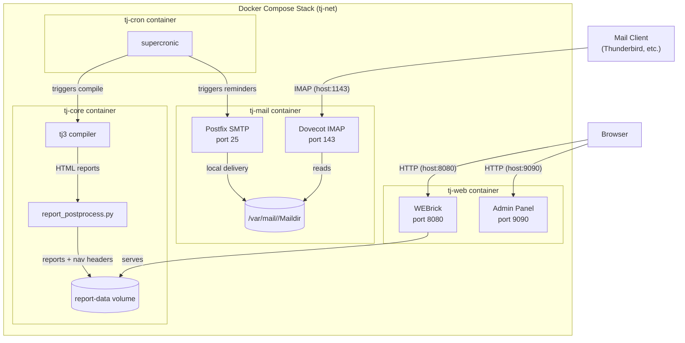

# Design Document: Integrated Mail and Reporting

## Overview

This design transforms the tjallin mail service from a relay-dependent Postfix setup into a self-contained mail system with both SMTP and IMAP capabilities, and extends the reporting pipeline with cross-linked navigation and journal reports.

**Key design decisions:**

1. **Dovecot for IMAP** — Dovecot is the standard lightweight IMAP server for Linux, supports Maildir natively, and integrates cleanly with Postfix for local delivery. It handles authentication against system users or a passwd-file, which aligns with the environment-variable-based user configuration.

2. **Post-processing for cross-links** — Rather than modifying TaskJuggler's report generation (which would require patching the Ruby gem), a Python post-processing script injects navigation headers into compiled HTML reports. This keeps the approach maintainable and decoupled from upstream TJ changes.

3. **Journal report via TJ native reporting** — TaskJuggler supports `journalmode` in task reports natively. The journal report is defined as a standard TJ report definition, with the post-processor adding navigation headers like all other reports.

4. **Elimination of external relay** — The mail service becomes fully local-delivery by default. An optional `TJ_SMTP_RELAY_HOST` variable enables relay for environments that need external forwarding.

## Architecture



### Service Changes Summary

| Service | Changes |
|---------|---------|
| tj-mail | Add Dovecot, remove external relay requirement, add user provisioning from `TJ_MAIL_USERS`, expose IMAP port, add maildir volume |
| tj-core | Add `report_postprocess.py` to inject navigation headers after compilation |
| tj-web | No changes (serves whatever is in report-data volume) |
| tj-cron | No changes (triggers same scripts) |

## Components and Interfaces

### 1. Mail User Provisioning (`services/tj-mail/scripts/provision-users.sh`)

Parses `TJ_MAIL_USERS` environment variable and creates system accounts with Maildir directories.

**Interface:**
- **Input:** `TJ_MAIL_USERS` env var (format: `"alice:pass1,bob:pass2"`)
- **Input:** `TJ_MAIL_SENDER` env var (fallback when `TJ_MAIL_USERS` is unset)
- **Output:** System users created with home directories and Maildir structure
- **Output:** Dovecot passwd-file at `/etc/dovecot/users` for IMAP authentication

**Behavior:**
- Parse comma-separated `user:password` pairs
- Skip malformed entries (log error, continue processing)
- If `TJ_MAIL_USERS` is empty/unset, create default user from `TJ_MAIL_SENDER` local-part
- Create `/var/mail/<user>/Maildir/{new,cur,tmp}` for each user
- Write Dovecot-compatible passwd-file entries

### 2. Mail User Parser (`src/tj_utils/parse_mail_users.py`)

Pure Python module for parsing and validating the `TJ_MAIL_USERS` format.

**Interface:**
```python
@dataclass
class MailUser:
    username: str
    password: str

@dataclass
class ParseResult:
    users: list[MailUser]
    errors: list[str]

def parse_mail_users(value: str | None, mail_sender: str = "taskjuggler@taskjuggler.local") -> ParseResult:
    """Parse TJ_MAIL_USERS into validated user accounts.
    
    Args:
        value: The TJ_MAIL_USERS environment variable value, or None/empty.
        mail_sender: The TJ_MAIL_SENDER value for default account fallback.
    
    Returns:
        ParseResult with valid users and any error messages for malformed entries.
    """
```

**Validation rules:**
- Username: 1–64 characters, alphanumeric plus `-_.`
- Password: 1–128 characters, no commas or colons
- Maximum 50 entries
- Entries not matching `user:password` format are skipped with error logged

### 3. Dovecot IMAP Configuration (`services/tj-mail/dovecot.conf`)

Minimal Dovecot configuration for IMAP access to Maildir.

**Key settings:**
- Protocol: IMAP only (no POP3)
- Auth: passwd-file at `/etc/dovecot/users`
- Mail location: `maildir:/var/mail/%u/Maildir`
- Listen: `*` (port 143 inside container)
- SSL: disabled (internal Docker network; TLS termination is external concern)

### 4. Report Post-Processor (`src/tj_utils/report_postprocess.py`)

Python script that injects navigation headers into compiled HTML reports.

**Interface:**
```python
@dataclass
class ReportInfo:
    filename: str
    title: str

def discover_reports(report_dir: Path) -> list[ReportInfo]:
    """Scan report directory for HTML files and extract titles from <title> or <h1> tags."""

def generate_nav_header(reports: list[ReportInfo], active_filename: str, admin_path: str = "../admin/") -> str:
    """Generate HTML navigation header with links to all reports and admin panel.
    
    Args:
        reports: All reports in the set.
        active_filename: The filename of the currently active report.
        admin_path: Relative path to admin panel.
    
    Returns:
        HTML string for the navigation header.
    """

def generate_index(reports: list[ReportInfo], admin_path: str = "admin/") -> str:
    """Generate Report_Index HTML page listing all reports with links."""

def inject_nav_headers(report_dir: Path) -> int:
    """Main entry point: discover reports, inject nav headers, generate index.
    
    Returns:
        Number of reports processed.
    """
```

**Behavior:**
- Scans report directory for `.html` files
- Extracts report titles from HTML `<title>` or first `<h1>` element
- Generates navigation header with relative links to all reports
- Marks the active report's link with CSS class `nav-active`
- Injects header after `<body>` tag in each report
- Generates `index.html` as the Report_Index
- Includes link to admin panel using relative path

### 5. Updated Compilation Script (`services/tj-core/scripts/compile.sh`)

Modified to invoke the post-processor after successful TJ3 compilation.

**Change:** After `tj3 -o "$REPORT_DIR" "$PROJECT_FILE"` succeeds, run:
```bash
python3 /app/src/report_postprocess.py "$REPORT_DIR"
```

### 6. Journal Report Definition

A TaskJuggler report definition added to the project's report includes.

**TJ definition pattern:**
```
taskreport JournalReport "Project Journal" {
  formats html
  headline "Project Journal"
  columns name, journal
  journalmode journal
  journalattributes headline, author, date, summary
  sortjournals date.down
  hidetask ~hasjournal()
}
```

The post-processor handles this report like any other HTML report — it discovers it, extracts its title, and includes it in navigation headers.

### 7. Docker Compose Changes

**New/modified in `docker-compose.yml`:**
- `tj-mail`: Add Dovecot package, expose IMAP port `127.0.0.1:${TJ_IMAP_PORT:-1143}:143`
- `tj-mail`: Add `maildir-data` named volume mounted at `/var/mail`
- `tj-mail`: Remove dependency on `TJ_SMTP_HOST`/`TJ_SMTP_PORT`/`TJ_SMTP_USER`/`TJ_SMTP_PASSWORD`
- `tj-mail`: Add optional `TJ_SMTP_RELAY_HOST` and `TJ_SMTP_RELAY_PORT` support
- New volume: `maildir-data` (separate from existing `mail-spool`)

### 8. Environment Variable Changes

**Removed:**
- `TJ_SMTP_HOST` (no longer required)
- `TJ_SMTP_PORT` (no longer required)
- `TJ_SMTP_USER` (no longer required)
- `TJ_SMTP_PASSWORD` (no longer required)

**Added:**
- `TJ_MAIL_USERS` — Comma-separated `user:password` pairs (optional, default: single user from `TJ_MAIL_SENDER`)
- `TJ_IMAP_PORT` — Host port for IMAP access (default: 1143, range: 1–65535)
- `TJ_SMTP_RELAY_HOST` — Optional external relay host for non-local delivery
- `TJ_SMTP_RELAY_PORT` — Optional external relay port (default: 25)

## Data Models

### Mail User Configuration

```python
from pydantic import BaseModel, Field, field_validator

class MailUserConfig(BaseModel):
    """A single mail user account."""
    username: str = Field(min_length=1, max_length=64, pattern=r'^[a-zA-Z0-9._-]+$')
    password: str = Field(min_length=1, max_length=128)

    @field_validator("password")
    @classmethod
    def password_no_delimiters(cls, v: str) -> str:
        if "," in v or ":" in v:
            raise ValueError("Password must not contain commas or colons")
        return v

class MailUsersConfig(BaseModel):
    """Parsed TJ_MAIL_USERS configuration."""
    users: list[MailUserConfig] = Field(max_length=50)
```

### Report Navigation Model

```python
from dataclasses import dataclass
from pathlib import Path

@dataclass
class ReportInfo:
    """Metadata for a single HTML report."""
    filename: str       # e.g., "GanttChart.html"
    title: str          # e.g., "Gantt Chart"
    filepath: Path      # Absolute path to the file

@dataclass
class NavigationContext:
    """Context for generating navigation headers."""
    reports: list[ReportInfo]
    active_filename: str
    admin_relative_path: str = "../admin/"
    index_filename: str = "index.html"
```

### Dovecot Passwd-File Format

Each line in `/etc/dovecot/users`:
```
username:{PLAIN}password:uid:gid::/var/mail/username::
```

Where uid/gid correspond to the system user created during provisioning.

## Correctness Properties

*A property is a characteristic or behavior that should hold true across all valid executions of a system — essentially, a formal statement about what the system should do. Properties serve as the bridge between human-readable specifications and machine-verifiable correctness guarantees.*

### Property 1: Local delivery to Maildir

*For any* valid email message addressed to a configured user at TJ_MAIL_DOMAIN, the SMTP server SHALL deliver the message to that user's Maildir, and the message content SHALL be retrievable from the Maildir.

**Validates: Requirements 1.2, 1.4, 3.5**

### Property 2: Non-local domain rejection

*For any* email message addressed to a domain other than TJ_MAIL_DOMAIN, the SMTP server SHALL reject the message with reply code 554.

**Validates: Requirements 1.5**

### Property 3: Non-existent user rejection

*For any* email message addressed to a username that is not in the configured user list at TJ_MAIL_DOMAIN, the SMTP server SHALL reject the message with reply code 550.

**Validates: Requirements 1.6**

### Property 4: Oversized message rejection

*For any* email message larger than 5,242,880 bytes, the SMTP server SHALL reject the message with reply code 552.

**Validates: Requirements 1.7**

### Property 5: IMAP authentication with valid credentials

*For any* user configured in TJ_MAIL_USERS, connecting to the IMAP server with that user's correct username and password SHALL result in successful authentication and access to the INBOX folder.

**Validates: Requirements 2.2**

### Property 6: IMAP authentication rejection with invalid credentials

*For any* username/password combination where the password does not match the configured password for that user (or the user does not exist), the IMAP server SHALL reject the connection with an authentication failure response.

**Validates: Requirements 2.5**

### Property 7: SMTP-to-IMAP message round-trip

*For any* valid email message delivered via SMTP to a configured user, retrieving that message via IMAP SHALL return content with matching subject, sender, and body.

**Validates: Requirements 2.6**

### Property 8: TJ_MAIL_USERS parsing correctness

*For any* TJ_MAIL_USERS string containing a mix of valid `user:password` entries and malformed entries, parsing SHALL extract all valid entries as MailUser objects and SHALL report errors for each malformed entry, with the count of valid users plus errors equaling the total entry count.

**Validates: Requirements 3.1, 3.2, 3.4**

### Property 9: Navigation header completeness

*For any* set of HTML report files in the report directory, the injected navigation header in each report SHALL contain links to every other report in the set and to the Report_Index.

**Validates: Requirements 5.1, 5.5**

### Property 10: Navigation links are relative with active styling

*For any* report in a set, all navigation links SHALL use relative file paths (no leading `/` or protocol prefix), and the link corresponding to the current report SHALL have the CSS class `nav-active` while all other links SHALL not have that class.

**Validates: Requirements 5.2, 5.3**

### Property 11: Report index completeness

*For any* set of HTML report files, the generated Report_Index SHALL contain an entry for each report with its title and a relative link to its filename.

**Validates: Requirements 5.4**

### Property 12: Journal entry rendering completeness

*For any* journal entry with a date, author, summary, and associated task name, the Journal_Report output SHALL contain all provided fields. For entries missing author or summary, the report SHALL still render the entry with available fields.

**Validates: Requirements 6.1, 6.2, 6.3**

### Property 13: Journal entry sort order

*For any* set of journal entries, the Journal_Report SHALL display them in reverse chronological order (newest first), with entries sharing the same date ordered alphabetically by task name.

**Validates: Requirements 6.4**

## Error Handling

### Mail Service Errors

| Error Condition | Behavior | Log Level |
|----------------|----------|-----------|
| `TJ_MAIL_USERS` malformed entry | Skip entry, log error, continue processing remaining | ERROR |
| `TJ_MAIL_USERS` empty/unset | Create default user from `TJ_MAIL_SENDER`, log info | INFO |
| SMTP delivery to non-local domain | Reject with 554 (or relay if `TJ_SMTP_RELAY_HOST` set) | WARNING |
| SMTP delivery to unknown user | Reject with 550 | WARNING |
| SMTP message too large | Reject with 552 | WARNING |
| Maildir write failure | Respond 451 (temp failure), queue for retry | ERROR |
| Dovecot auth failure | Return IMAP NO response | INFO |
| Relay host unreachable | Queue message for retry, log error | ERROR |
| `TJ_MAIL_DOMAIN` unset | Refuse to start, exit 1 | ERROR |

### Report Post-Processing Errors

| Error Condition | Behavior | Log Level |
|----------------|----------|-----------|
| No HTML files in report directory | Log warning, generate empty index | WARNING |
| Cannot parse `<title>` from report | Use filename (without extension) as title | WARNING |
| Cannot write to report file | Log error, skip that file, continue others | ERROR |
| Report directory does not exist | Log error, exit with non-zero code | ERROR |

### Startup Validation

The mail service entrypoint validates:
1. `TJ_MAIL_DOMAIN` is set and non-empty (required, fatal if missing)
2. `TJ_MAIL_USERS` format (non-fatal, skips bad entries)
3. `TJ_IMAP_PORT` is valid port range if set (non-fatal, uses default 1143)

## Testing Strategy

### Property-Based Tests (Hypothesis)

The project already uses Hypothesis for property-based testing. New property tests will follow the established pattern in `tests/property/`.

**Library:** Hypothesis (already in dev dependencies)
**Configuration:** Minimum 100 examples per property (`@settings(max_examples=100)`)
**Tag format:** `Feature: integrated-mail-and-reporting, Property {N}: {description}`

**Testable properties (pure logic, suitable for PBT):**

| Property | Module Under Test | Strategy |
|----------|------------------|----------|
| 8: TJ_MAIL_USERS parsing | `src/tj_utils/parse_mail_users.py` | Generate random user:password strings with valid/invalid entries |
| 9: Navigation header completeness | `src/tj_utils/report_postprocess.py` | Generate random report filename/title sets |
| 10: Relative links + active styling | `src/tj_utils/report_postprocess.py` | Generate random report sets, verify href format and active class |
| 11: Report index completeness | `src/tj_utils/report_postprocess.py` | Generate random report sets, verify index content |
| 12: Journal entry rendering | `src/tj_utils/report_postprocess.py` | Generate random journal entries with optional fields |
| 13: Journal entry sort order | `src/tj_utils/report_postprocess.py` | Generate random entries with dates/task names, verify order |

**Properties requiring integration testing (SMTP/IMAP interaction):**

Properties 1–7 involve actual SMTP/IMAP server behavior. These are best tested as integration tests with a few representative examples rather than 100+ iterations (each iteration requires network I/O to Postfix/Dovecot).

### Unit Tests (pytest)

- `test_parse_mail_users.py` — Example-based tests for edge cases: empty input, single user, max 50 users, default fallback from TJ_MAIL_SENDER
- `test_report_postprocess.py` — Example-based tests for HTML injection, title extraction, admin link presence
- `test_journal_report.py` — Empty journal entries message, specific formatting examples

### Integration Tests (Docker-based)

- `test_mail_delivery.py` — Send email via SMTP, verify Maildir delivery
- `test_imap_access.py` — Connect via IMAP, authenticate, list folders, fetch message
- `test_smtp_rejection.py` — Non-local domain (554), unknown user (550), oversized (552)
- `test_mail_persistence.py` — Deliver message, restart container, verify message persists
- `test_report_navigation.py` — Compile project, verify navigation headers in output HTML
- `test_startup_no_relay.py` — Start without relay variables, verify service accepts connections

### Test File Organization

```
tests/
├── property/
│   ├── test_parse_mail_users_property.py      # Property 8
│   ├── test_nav_header_property.py            # Properties 9, 10
│   ├── test_report_index_property.py          # Property 11
│   └── test_journal_report_property.py        # Properties 12, 13
├── unit/
│   ├── test_parse_mail_users.py
│   ├── test_report_postprocess.py
│   └── test_journal_report.py
└── integration/
    ├── test_mail_delivery.py
    ├── test_imap_access.py
    ├── test_smtp_rejection.py
    ├── test_mail_persistence.py
    └── test_report_navigation.py
```
