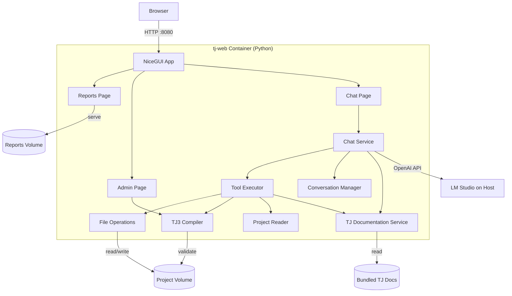
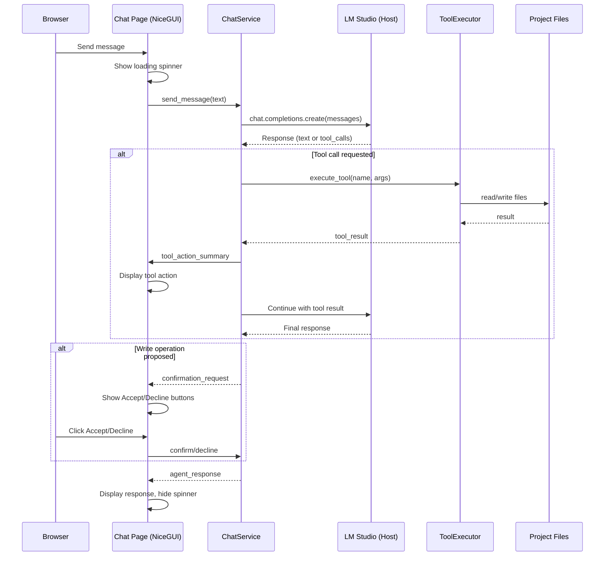

# Design Document: LLM Agent Chat

## Overview

The LLM Agent Chat feature replaces the existing Ruby-based tj-web service with a unified NiceGUI web application that consolidates three capabilities into a single Python service:

1. **Report Viewer** — Serves TaskJuggler-generated HTML reports (replacing the WEBrick file server)
2. **Admin Panel** — Project compilation triggers and system status (replacing the Ruby admin server)
3. **Agent Chat** — Browser-based conversational interface for project management via LM Studio

The architecture follows a tool-calling pattern: the LLM generates structured tool calls that the Chat Service executes against the project files. All write operations are validated through the tj3 compiler before persisting, and backups are created before any file modification.

Key design goals:
- **Unified web interface**: Single NiceGUI app on port 8080 replaces two Ruby servers (8080 + 9090)
- **Local-first**: All inference runs on the user's machine via LM Studio — no external API calls
- **Safe writes**: Compiler validation + backup + user confirmation before any file change
- **Conversational context**: Multi-turn sessions with history management and token-aware truncation
- **Proactive assistance**: The agent analyzes project state and suggests next steps
- **Graceful degradation**: Reports and admin work even when LM Studio is offline

## Architecture



### High-Level Design

The system is structured as a single Python service (`tj-web`) running inside Docker with these layers:

1. **NiceGUI Web Layer** — Multi-page app with navigation, routing, and UI components
2. **Chat Service Layer** — Orchestrates conversation flow, manages LM Studio communication
3. **Tool Execution Layer** — Executes tool calls requested by the LLM, enforces safety
4. **Project Access Layer** — Reads/writes TaskJuggler files, invokes tj3 compiler

### Low-Level Design

The service runs as a NiceGUI application inside the tj-web Docker container, listening on port 8080. It communicates with LM Studio on the host machine (via Docker host networking or configured URL) and accesses project files and reports through Docker volume mounts.



### Docker Integration

The tj-web Dockerfile changes from Ruby to Python:

```dockerfile
FROM python:3.11-slim

# Install tj3 for compilation
RUN apt-get update && apt-get install -y --no-install-recommends \
    ruby curl && gem install taskjuggler --no-document && \
    rm -rf /var/lib/apt/lists/*

# Install Python dependencies
COPY pyproject.toml uv.lock /app/
WORKDIR /app
RUN pip install uv && uv sync --frozen

# Copy application code
COPY src/ /app/src/

# Bundle TaskJuggler reference documentation for offline availability
COPY docs/tj-reference/ /app/tj-docs/

EXPOSE 8080
CMD ["uv", "run", "tj-web"]
```

Volume mounts remain the same as the current tj-web service:
- `${TJ_PROJECT_PATH:-./project}:/app/project` — Project files (read/write)
- `report-data:/app/reports` — Generated HTML reports (read-only for serving)

## Components and Interfaces

### 1. NiceGUI Application (`tj_chat/app.py`)

Main application entry point with page routing and shared navigation.

```python
from nicegui import app, ui

def create_app() -> None:
    """Configure and create the NiceGUI application."""
    
    app.add_static_files("/report-files", "/app/reports")

    @ui.page("/")
    def home_page() -> None: ...

    @ui.page("/reports")
    def reports_page() -> None: ...

    @ui.page("/admin")
    def admin_page() -> None: ...

    @ui.page("/chat")
    def chat_page() -> None: ...
```

### 2. Chat Page (`tj_chat/pages/chat.py`)

Browser-based chat interface using NiceGUI's chat components.

```python
class ChatPageUI:
    """Chat page with message history, input, and confirmation dialogs."""

    def __init__(self, chat_service: ChatService) -> None: ...
    def setup(self) -> None: ...
    async def send_message(self) -> None: ...
    def display_agent_message(self, text: str) -> None: ...
    def display_tool_action(self, tool_name: str, summary: str) -> None: ...
    def display_system_message(self, text: str) -> None: ...
    async def show_confirmation(self, summary: str) -> bool: ...
    def handle_slash_command(self, command: str) -> bool: ...
```

### 3. Reports Page (`tj_chat/pages/reports.py`)

Serves TaskJuggler-generated HTML reports with navigation.

```python
class ReportsPageUI:
    """Reports page listing and displaying TJ-generated HTML reports."""

    def __init__(self, reports_dir: Path) -> None: ...
    def setup(self) -> None: ...
    def list_reports(self) -> list[ReportFile]: ...
    def display_report(self, report_name: str) -> None: ...
```

### 4. Admin Page (`tj_chat/pages/admin.py`)

Project administration with compilation triggers and status.

```python
class AdminPageUI:
    """Admin page with compilation trigger and system status."""

    def __init__(self, project_dir: Path, reports_dir: Path) -> None: ...
    def setup(self) -> None: ...
    async def trigger_rebuild(self) -> None: ...
    def get_status(self) -> SystemStatus: ...
```

### 5. Chat Service (`tj_chat/chat_service.py`)

Core orchestration layer managing LM Studio communication and conversation state.

```python
class ChatService:
    """Manages conversation flow and LM Studio communication."""

    def __init__(self, settings: ChatSettings, tool_executor: ToolExecutor) -> None: ...
    async def connect(self) -> ConnectionResult: ...
    async def send_message(self, user_input: str) -> AgentResponse: ...
    async def reset_session(self) -> None: ...
    def build_system_prompt(self, project_summary: ProjectSummary) -> str:
        """Build system prompt including project structure, tool descriptions,
        and condensed TJ syntax reference from bundled documentation."""
        ...
```

### 6. Conversation Manager (`tj_chat/conversation.py`)

Manages message history with token-aware truncation.

```python
class ConversationManager:
    """Maintains conversation history with token limit management."""

    def __init__(self, token_limit: int, min_recent_exchanges: int = 4) -> None: ...
    def add_message(self, message: Message) -> None: ...
    def get_messages(self, system_prompt: str) -> list[Message]: ...
    def truncate_to_limit(self, system_prompt: str) -> list[Message]: ...
    def clear(self) -> None: ...
    def estimate_tokens(self, messages: list[Message]) -> int: ...
```

### 7. Tool Executor (`tj_chat/tool_executor.py`)

Executes tool calls with safety enforcement.

```python
class ToolExecutor:
    """Executes LLM tool calls with path safety and confirmation."""

    def __init__(self, project_dir: Path, settings: ChatSettings) -> None: ...
    async def execute(
        self, tool_call: ToolCall, confirm_fn: ConfirmFn
    ) -> ToolResult: ...
    def validate_path(self, path: str) -> Path: ...
    def create_backup(self, file_path: Path) -> Path: ...
    async def validate_with_compiler(self, project_file: Path) -> CompilerResult: ...
```

### 8. Project Reader (`tj_chat/project_reader.py`)

Reads and parses TaskJuggler project structure.

```python
class ProjectReader:
    """Reads TaskJuggler project files and extracts structured information."""

    def __init__(self, project_dir: Path) -> None: ...
    def get_project_summary(self) -> ProjectSummary: ...
    def list_tasks(self) -> list[TaskInfo]: ...
    def list_resources(self) -> list[ResourceInfo]: ...
    def find_task(self, query: str) -> list[TaskMatch]: ...
    def find_resource(self, query: str) -> list[ResourceMatch]: ...
    def get_file_tree(self) -> list[str]: ...
```

### 9. TJ Generators (`tj_chat/generators.py`)

Generates valid TaskJuggler syntax for various constructs.

```python
class TimesheetGenerator:
    """Generates valid TaskJuggler timesheet blocks."""

    def generate(self, booking: BookingRequest) -> str: ...
    def merge_into_existing(self, existing: str, new_entry: TaskEntry) -> str: ...

class JournalEntryGenerator:
    """Generates valid TaskJuggler journal entry statements."""

    def generate(self, entry: JournalEntryRequest) -> str: ...

class ReportGenerator:
    """Generates valid TaskJuggler report definitions."""

    def generate(self, report: ReportRequest) -> str: ...

class TaskGenerator:
    """Generates valid TaskJuggler task definitions."""

    def generate(self, task: TaskRequest) -> str: ...
```

### 10. TJ Documentation Service (`tj_chat/tj_docs.py`)

Loads and searches the bundled TaskJuggler reference documentation.

```python
class TJDocumentationService:
    """Loads bundled TJ reference docs and provides search and syntax reference."""

    def __init__(self, docs_path: Path) -> None:
        """Load documentation from configured path.
        
        If docs_path is missing or unreadable, logs a warning and operates
        in degraded mode (search returns empty, syntax reference returns empty string).
        """
        ...

    def search(self, query: str) -> list[DocSection]:
        """Search documentation for sections matching query terms.
        
        Returns relevant sections ordered by relevance score.
        Performs case-insensitive matching against section titles and content.
        """
        ...

    def get_syntax_reference(self) -> str:
        """Return condensed key syntax sections for inclusion in system prompt.
        
        Covers: task, resource, account, report, timesheet, journalentry,
        and macro definitions. Returns empty string if docs unavailable.
        """
        ...

    @property
    def is_available(self) -> bool:
        """Whether documentation was successfully loaded."""
        ...
```

### 11. Path Validator (`tj_chat/path_safety.py`)

Ensures all file operations stay within the project boundary.

```python
def validate_project_path(path: str | Path, project_root: Path) -> Path:
    """Resolve path to canonical form and verify it's within project_root.
    
    Raises PathSecurityError if path escapes project boundary.
    """
    ...

def is_within_project(resolved_path: Path, project_root: Path) -> bool:
    """Check if resolved path is within or equal to project_root."""
    ...
```

### 12. Settings (`tj_chat/settings.py`)

Configuration via pydantic-settings.

```python
class ChatSettings(BaseSettings):
    """Configuration for the LLM agent chat service."""

    model_config = SettingsConfigDict(env_prefix="TJ_CHAT_")

    lm_studio_url: str = "http://localhost:1234/v1"
    model_name: str | None = None
    token_limit: int = 4096
    connection_timeout: int = 10
    response_timeout: int = 120
    default_author: str | None = None
    project_path: Path = Path("/app/project")
    project_file: str = "project.tjp"
    reports_path: Path = Path("/app/reports")
    tj_docs_path: Path = Path("/app/tj-docs")
    web_port: int = 8080
```

### Tool Definitions

The following tools are exposed to the LLM via the OpenAI function-calling schema:

| Tool Name | Description | Parameters |
|-----------|-------------|------------|
| `read_file` | Read a project file | `path: str` |
| `list_files` | List files in project directory | `subdirectory: str?` |
| `list_tasks` | List all tasks with hierarchy | — |
| `list_resources` | List all resources | — |
| `find_task` | Find task by name/ID | `query: str` |
| `find_resource` | Find resource by name/ID | `query: str` |
| `write_file` | Write content to a project file | `path: str, content: str` |
| `update_task` | Modify task attributes | `task_path: str, attributes: dict` |
| `add_task` | Add new task definition | `parent_path: str, task: dict` |
| `update_resource` | Modify resource attributes | `resource_id: str, attributes: dict` |
| `write_timesheet` | Write/merge timesheet entry | `resource_id: str, week: str?, entries: list` |
| `write_journal` | Write journal entry | `task_path: str?, date: str?, author: str?, headline: str, summary: str?` |
| `write_report` | Write report definition | `report_id: str, report_type: str, config: dict` |
| `compile_project` | Run tj3 compiler and return result | — |
| `search_tj_docs` | Search bundled TJ reference documentation | `query: str` |

## Data Models

```python
from datetime import date
from enum import Enum
from pathlib import Path
from pydantic import BaseModel, Field


class Message(BaseModel):
    """A single message in the conversation history."""
    role: str  # "system", "user", "assistant", "tool"
    content: str | None = None
    tool_calls: list[ToolCallMessage] | None = None
    tool_call_id: str | None = None
    name: str | None = None


class ToolCallMessage(BaseModel):
    """A tool call within an assistant message."""
    id: str
    type: str = "function"
    function: FunctionCall


class FunctionCall(BaseModel):
    """Function call details."""
    name: str
    arguments: str  # JSON string


class ToolCall(BaseModel):
    """Parsed tool call ready for execution."""
    id: str
    name: str
    arguments: dict


class ToolResult(BaseModel):
    """Result of a tool execution."""
    tool_call_id: str
    success: bool
    content: str
    requires_confirmation: bool = False
    confirmation_summary: str | None = None


class AgentResponse(BaseModel):
    """Complete response from the agent including any tool actions."""
    text: str
    tool_actions: list[ToolAction] = Field(default_factory=list)
    confirmation_request: ConfirmationRequest | None = None


class ToolAction(BaseModel):
    """Summary of a tool action taken during response generation."""
    tool_name: str
    summary: str


class ConfirmationRequest(BaseModel):
    """A write operation awaiting user confirmation."""
    file_path: str
    operation_type: str  # "create", "modify", "delete"
    description: str
    pending_content: str


class ConnectionResult(BaseModel):
    """Result of connecting to LM Studio."""
    success: bool
    model_name: str | None = None
    error: str | None = None


class CompilerResult(BaseModel):
    """Result of running the tj3 compiler."""
    success: bool
    stdout: str
    stderr: str


class SystemStatus(BaseModel):
    """System status for the admin page."""
    project_file: str
    project_exists: bool
    report_count: int
    timesheet_count: int
    lm_studio_connected: bool


class ReportFile(BaseModel):
    """A generated report file available for viewing."""
    name: str
    path: str
    size: int
    modified: str


class BookingStatus(str, Enum):
    """Timesheet task status colors."""
    GREEN = "green"
    YELLOW = "yellow"
    RED = "red"


class TaskEntry(BaseModel):
    """A single task entry within a timesheet."""
    task_path: str
    hours: float = Field(gt=0)
    status_color: BookingStatus | None = None
    status_headline: str | None = None
    status_summary: str | None = None


class BookingRequest(BaseModel):
    """Request to write a timesheet booking."""
    resource_id: str
    week_start: date  # Monday of the ISO week
    entries: list[TaskEntry]


class JournalEntryRequest(BaseModel):
    """Request to write a journal entry."""
    task_path: str | None = None
    entry_date: date
    author: str
    headline: str = Field(max_length=120)
    summary: str | None = None


class ReportType(str, Enum):
    """Supported TaskJuggler report types."""
    TASK = "taskreport"
    RESOURCE = "resourcereport"
    ACCOUNT = "accountreport"
    TEXT = "textreport"
    STATUS = "statusreport"


class ReportRequest(BaseModel):
    """Request to write a report definition."""
    report_id: str
    report_type: ReportType
    title: str
    columns: list[str]
    formats: list[str] = Field(default_factory=lambda: ["html"])
    sort_order: str | None = None
    hide_expression: str | None = None
    time_scale: str | None = None
    caption: str | None = None


class TaskInfo(BaseModel):
    """Parsed task information from project files."""
    path: str  # Full dotted path e.g. "acme.development.backend_api.schema"
    name: str
    effort: str | None = None
    allocations: list[str] = Field(default_factory=list)
    dependencies: list[str] = Field(default_factory=list)
    is_milestone: bool = False


class ResourceInfo(BaseModel):
    """Parsed resource information from project files."""
    id: str
    name: str
    rate: float | None = None
    working_hours: str | None = None


class TaskMatch(BaseModel):
    """A task matching a search query with similarity score."""
    task: TaskInfo
    score: float


class ResourceMatch(BaseModel):
    """A resource matching a search query."""
    resource: ResourceInfo
    exact: bool


class ProjectSummary(BaseModel):
    """Summary of the project structure for the system prompt."""
    project_name: str
    start_date: str
    end_date: str
    now_date: str
    file_tree: list[str]
    resource_ids: list[str]
    top_level_tasks: list[str]


class PathSecurityError(Exception):
    """Raised when a file path escapes the project boundary."""
    def __init__(self, path: str, project_root: str) -> None:
        super().__init__(
            f"Path '{path}' is outside the allowed project directory '{project_root}'"
        )
        self.path = path
        self.project_root = project_root


class DocSection(BaseModel):
    """A section from the bundled TaskJuggler reference documentation."""
    title: str  # Section heading, e.g. "task", "resource", "timesheet"
    content: str  # Full text content of the section
    relevance_score: float = Field(ge=0.0, le=1.0)  # Match relevance to query
```


## Correctness Properties

*A property is a characteristic or behavior that should hold true across all valid executions of a system — essentially, a formal statement about what the system should do. Properties serve as the bridge between human-readable specifications and machine-verifiable correctness guarantees.*

### Property 1: Path security rejects out-of-bounds paths

*For any* file path that, when resolved to its canonical absolute form (resolving `..`, `.`, and symlinks), falls outside the configured project directory, the path validator SHALL reject the operation and raise a `PathSecurityError`.

**Validates: Requirements 7.3, 7.4, 7.5**

### Property 2: Backup creation before file writes

*For any* file modification operation on an existing project file, the system SHALL create a `.bak` copy of the original file content in the same directory before writing the new content, such that the backup file contains byte-for-byte identical content to the original.

**Validates: Requirements 3.6**

### Property 3: Failed compilation preserves original file

*For any* proposed file modification that causes the tj3 compiler to return errors, the original file SHALL remain unchanged (byte-for-byte identical to its state before the write attempt).

**Validates: Requirements 3.5**

### Property 4: Declined write operations preserve file state

*For any* proposed write operation that the user declines, the target file SHALL remain unchanged (byte-for-byte identical to its state before the proposal).

**Validates: Requirements 7.2**

### Property 5: Timesheet generation produces valid structure

*For any* valid `BookingRequest` containing a resource ID, week start date, and one or more task entries (each with hours and optional status), the generated timesheet output SHALL contain a single `timesheet` block with the resource ID and date range, all task entries with their `work` hours, and for entries with status, a valid `status` line with color and headline.

**Validates: Requirements 4.1, 4.4, 4.8**

### Property 6: Timesheet file naming convention

*For any* resource ID and ISO week date, the generated timesheet filename SHALL match the pattern `YYYY-Www-<resource_id>.tji` where YYYY is the ISO year, ww is the zero-padded ISO week number, and resource_id is the exact resource identifier.

**Validates: Requirements 4.2**

### Property 7: Timesheet merge preserves unrelated entries

*For any* existing timesheet containing task entries and a new task entry to merge, the resulting merged timesheet SHALL contain all original entries for tasks not matching the new entry's task path, and SHALL replace the entry for the matching task path with the new entry's data.

**Validates: Requirements 4.3**

### Property 8: Journal entry generation produces valid syntax

*For any* valid `JournalEntryRequest` with a date, author, and headline (at most 120 characters), the generated output SHALL be a syntactically valid TaskJuggler `journalentry` statement containing the date in YYYY-MM-DD format, the author resource ID, and the headline text.

**Validates: Requirements 5.1**

### Property 9: Report generation produces valid structure

*For any* valid `ReportRequest` with a report ID, report type, title, and column list, the generated output SHALL be a syntactically valid TaskJuggler report definition of the specified type containing the report ID, title as headline, and all specified columns.

**Validates: Requirements 9.1**

### Property 10: Task similarity search returns bounded ordered results

*For any* query string and list of existing task paths where the query does not exactly match any path, the similarity search SHALL return at most 5 results ordered by decreasing similarity score.

**Validates: Requirements 4.5, 5.6**

### Property 11: Conversation history preserves message order

*For any* sequence of messages added to the conversation manager, retrieving the history SHALL return messages in the same order they were added (insertion order preserved).

**Validates: Requirements 6.1**

### Property 12: Conversation truncation respects token limit and preserves recent context

*For any* conversation history that exceeds the configured token limit, the truncated result SHALL: (a) not exceed the token limit, (b) include the system prompt, and (c) include at minimum the 4 most recent exchanges (user message + assistant response pairs).

**Validates: Requirements 6.2, 6.3**

### Property 13: System prompt contains project structure, tool names, and TJ syntax reference

*For any* `ProjectSummary` containing file names, resource IDs, and task names, the generated system prompt SHALL contain all file names from the project tree, all tool names from the tool registry, descriptions of include file purposes, and (when documentation is available) a condensed TaskJuggler syntax reference covering key constructs.

**Validates: Requirements 6.4, 13.3, 13.4**

### Property 14: Overdue detection uses configured project date

*For any* task with a planned end date before the project's configured `now` date and without 100% completion, the overdue detection SHALL flag that task as overdue and report the correct number of days between the planned end date and the configured `now` date.

**Validates: Requirements 8.4, 8.5**

### Property 15: Whitespace-only input is rejected without agent invocation

*For any* string composed entirely of whitespace characters (spaces, tabs, newlines), the chat interface SHALL not send a message to the Chat Service.

**Validates: Requirements 11.8**

### Property 16: Unknown slash commands produce help suggestion

*For any* input string starting with `/` that does not match a known command (`/reset`, `/help`), the chat interface SHALL display an error message containing the unrecognized command text and a suggestion to use `/help`.

**Validates: Requirements 11.7**

### Property 17: Write confirmation summary contains required information

*For any* proposed write operation, the confirmation summary presented to the user SHALL contain the target file path, the type of operation (create, modify, or delete), and a non-empty description of the content change.

**Validates: Requirements 7.1**

### Property 18: Task generation includes required attributes

*For any* valid `TaskRequest` specifying a task ID, name, effort, and allocation, the generated TaskJuggler task definition SHALL contain the task ID, the task name as a quoted string, an `effort` line, and an `allocate` line.

**Validates: Requirements 3.2**

### Property 19: TJ docs search returns relevant sections matching query terms

*For any* non-empty query string and a loaded documentation corpus, the `search_tj_docs` tool SHALL return only `DocSection` results whose title or content contains at least one term from the query (case-insensitive), and results SHALL be ordered by decreasing relevance score.

**Validates: Requirements 13.5**

## Error Handling

### Connection Errors

| Error | Handling |
|-------|----------|
| LM Studio unreachable | Display error banner on chat page with configured endpoint URL, suggest checking LM Studio is running. Reports and admin pages remain functional. |
| Connection timeout (>10s) | Display timeout error on chat page, suggest verifying endpoint URL |
| Model not found | Display available models from LM Studio, suggest configuration |
| API error (4xx/5xx) | Display HTTP status and error body in chat, suggest checking LM Studio logs |

### File Operation Errors

| Error | Handling |
|-------|----------|
| File not found | Inform user which file is missing, continue with available files |
| Permission denied | Display permission error, suggest checking file ownership |
| Path outside project | Reject with `PathSecurityError`, inform user of boundary |
| Backup creation fails | Abort write operation, inform user backup could not be created |

### Compiler Errors

| Error | Handling |
|-------|----------|
| tj3 not found | Display error suggesting tj3 installation check |
| Compilation failure | Display full compiler stderr in chat, preserve original file, suggest fixes |
| Compiler timeout | Display timeout error, preserve original file |

### Conversation Errors

| Error | Handling |
|-------|----------|
| Token limit exceeded | Truncate oldest messages, preserve system prompt + last 4 exchanges |
| Response timeout (>120s) | Display timeout error inline in chat, preserve conversation state |
| Malformed tool call | Log error, display internal error message in chat, continue conversation |
| Tool execution failure | Include error in conversation history, inform user, suggest alternatives |

### Web Application Errors

| Error | Handling |
|-------|----------|
| Reports directory empty | Display "no reports yet" message with link to admin rebuild |
| Report file not found | Display 404 message, link back to reports list |
| Admin rebuild fails | Display compiler error output on admin page |
| NiceGUI startup failure | Log error, exit with non-zero code for Docker restart |

### Documentation Errors

| Error | Handling |
|-------|----------|
| TJ docs path missing | Log warning at startup, continue without docs. Display notice on chat page that enhanced TJ syntax support is unavailable. |
| TJ docs file unreadable | Log warning with file path, continue without docs. `search_tj_docs` returns empty results. |
| TJ docs exceed token budget | Include condensed syntax reference in system prompt, provide full docs via `search_tj_docs` tool only |

### Input Validation Errors

| Error | Handling |
|-------|----------|
| Empty/whitespace input | Silently ignore, keep input field focused |
| Unknown slash command | Display error with suggestion to use `/help` as system message |
| Ambiguous task/resource match | Present matches in chat, request clarification |
| Non-existent task path | Show up to 5 similar paths in chat |
| Non-existent resource ID | List all available resource IDs in chat |
| Invalid hours (≤0 or exceeds capacity) | Inform user of valid range |
| Headline exceeds 120 chars | Inform user of limit, suggest truncation |

## Testing Strategy

### Property-Based Tests (Hypothesis)

Property-based testing is appropriate for this feature because it contains significant pure logic:
- Path validation (security boundary checking)
- Syntax generation (timesheets, journal entries, reports, tasks)
- Conversation management (ordering, truncation)
- Search/matching algorithms (similarity scoring, documentation search)
- Input validation (whitespace rejection, command parsing)

**Library**: `hypothesis` (already in dev dependencies)
**Configuration**: Minimum 100 examples per property test (`@settings(max_examples=100)`)
**Tag format**: Comment at top of each test class referencing the design property

Each of the 19 correctness properties above maps to one property-based test in `tests/property/test_tj_chat_*.py`.

### Unit Tests (pytest)

Unit tests cover specific examples, edge cases, and integration points:

- **Connection handling**: Timeout, refused, successful connection scenarios
- **Slash commands**: `/reset`, `/help` behavior
- **Default values**: Default URL, default week, default author
- **Conflict detection**: Duplicate report IDs, ambiguous task matches
- **Specific report types**: Gantt chart generation, audience-specific reports
- **Graceful degradation**: Chat error when LM Studio offline, reports still work

### Integration Tests

Integration tests verify end-to-end workflows with mocked LM Studio:

- Full conversation flow: user message → tool call → response
- Write workflow: propose → confirm → backup → validate → write
- Session lifecycle: start → converse → reset → converse
- Proactive guidance: session start summary, post-action suggestions
- Admin rebuild: trigger compilation, verify report generation
- Report serving: verify HTML reports accessible via /reports

### Test File Organization

```
tests/
├── property/
│   ├── test_tj_chat_path_safety_property.py      # Property 1
│   ├── test_tj_chat_backup_property.py           # Property 2
│   ├── test_tj_chat_compiler_safety_property.py  # Properties 3, 4
│   ├── test_tj_chat_timesheet_property.py        # Properties 5, 6, 7
│   ├── test_tj_chat_journal_property.py          # Property 8
│   ├── test_tj_chat_report_property.py           # Property 9
│   ├── test_tj_chat_search_property.py           # Property 10
│   ├── test_tj_chat_conversation_property.py     # Properties 11, 12, 13
│   ├── test_tj_chat_overdue_property.py          # Property 14
│   ├── test_tj_chat_input_property.py            # Properties 15, 16
│   ├── test_tj_chat_confirmation_property.py     # Property 17
│   ├── test_tj_chat_task_gen_property.py         # Property 18
│   └── test_tj_chat_tj_docs_property.py          # Property 19
├── unit/
│   ├── test_tj_chat_connection.py
│   ├── test_tj_chat_commands.py
│   ├── test_tj_chat_defaults.py
│   ├── test_tj_chat_reports.py
│   └── test_tj_chat_admin.py
└── integration/
    ├── test_tj_chat_conversation_flow.py
    ├── test_tj_chat_write_workflow.py
    └── test_tj_chat_web_app.py
```

### Dependencies to Add

```toml
# In pyproject.toml [project.dependencies]
nicegui = ">=2.0"
httpx = ">=0.27"  # Async HTTP client for LM Studio API
```
