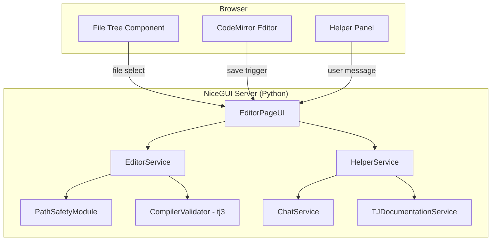
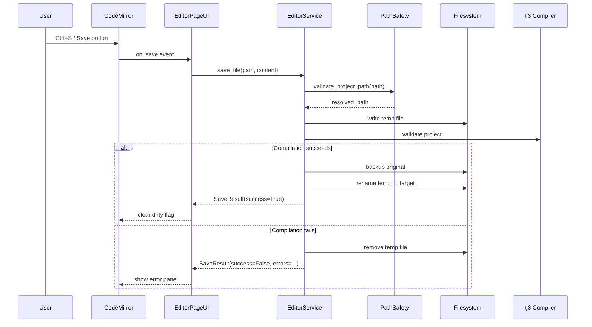

# Design Document: Project File Editor

## Overview

The Project File Editor adds a built-in code editing experience for TaskJuggler project files (.tjp and .tji) within the existing NiceGUI web application. It provides a three-panel layout at `/editor` consisting of a file tree browser, a CodeMirror-based code editor with TJ syntax highlighting, and an inline agentic helper panel for context-aware TJ syntax assistance.

The editor integrates with existing infrastructure: `PathSafetyModule` for file boundary enforcement, `ToolExecutor.validate_with_compiler` for save validation, `ChatService` for LLM communication, and `TJDocumentationService` for grounding AI responses in reference documentation.

### Key Design Decisions

1. **CodeMirror via NiceGUI's `ui.codemirror`**: NiceGUI ships with a CodeMirror integration. We use it directly with a custom TJ language mode for syntax highlighting, avoiding additional frontend build steps.

2. **Server-side file operations**: All file I/O happens server-side through async Python handlers. The browser never directly accesses the filesystem — it communicates via NiceGUI's auto-binding and event system.

3. **Compiler-gated saves**: Every save writes to a temporary file first, runs `tj3` validation, and only persists on success. This reuses the existing `ToolExecutor._safe_write` pattern but adapted for the editor's interactive workflow.

4. **Dedicated EditorService**: A new service class encapsulates file tree building, file read/write with validation, and backup logic. This keeps the page UI class thin and the business logic testable.

5. **Separate helper chat context**: The Helper Panel maintains its own conversation history (independent of the main Chat page) with a specialized system prompt focused on TJ syntax assistance and diff-based suggestions.

## Architecture



### Request Flow: Save Operation



## Components and Interfaces

### EditorPageUI (`src/tj_chat/pages/editor.py`)

The NiceGUI page class registered at `/editor`. Responsible for:
- Rendering the three-panel layout (file tree, editor, helper)
- Handling UI events (file selection, save, helper messages)
- Coordinating between EditorService and HelperService

```python
class EditorPageUI:
    def __init__(
        self,
        editor_service: EditorService,
        helper_service: HelperService,
        settings: ChatSettings,
    ) -> None: ...

    def setup(self) -> None:
        """Render the editor page layout and bind events."""
        ...
```

### EditorService (`src/tj_chat/editor_service.py`)

Encapsulates all file operations for the editor with path safety and compiler validation.

```python
class EditorService:
    def __init__(self, project_dir: Path, settings: ChatSettings) -> None: ...

    def build_file_tree(self) -> list[FileNode]:
        """Build hierarchical file tree for the project directory."""
        ...

    async def read_file(self, relative_path: str) -> FileContent:
        """Read a file within the project boundary."""
        ...

    async def save_file(self, relative_path: str, content: str) -> SaveResult:
        """Save with temp-write → compile → backup → persist workflow."""
        ...
```

### HelperService (`src/tj_chat/helper_service.py`)

Manages the agentic helper panel's LLM interactions with editor-specific context.

```python
class HelperService:
    def __init__(
        self,
        settings: ChatSettings,
        tj_docs: TJDocumentationService | None,
    ) -> None: ...

    async def send_message(
        self,
        user_message: str,
        context: EditorContext,
    ) -> HelperResponse:
        """Send a context-enriched message to the LLM."""
        ...

    def reset_session(self) -> None:
        """Clear conversation history."""
        ...
```

### Key Interfaces

```python
# File tree node for the sidebar
class FileNode(BaseModel):
    name: str
    path: str  # Relative to project root
    is_directory: bool
    children: list[FileNode] = Field(default_factory=list)
    file_type: Literal["tjp", "tji", "other"] = "other"

# Result of reading a file
class FileContent(BaseModel):
    path: str
    content: str
    success: bool
    error: str | None = None

# Result of a save operation
class SaveResult(BaseModel):
    success: bool
    errors: list[str] = Field(default_factory=list)
    backup_path: str | None = None

# Context sent with helper panel messages
class EditorContext(BaseModel):
    file_path: str | None = None
    file_content: str | None = None
    cursor_line: int = 0
    surrounding_lines: str = ""  # 10 lines above/below cursor
    project_files: list[str] = Field(default_factory=list)

# Response from the helper service
class HelperResponse(BaseModel):
    text: str
    suggestions: list[DiffSuggestion] = Field(default_factory=list)
    error: str | None = None

# A diff-based code suggestion
class DiffSuggestion(BaseModel):
    file_path: str
    start_line: int
    end_line: int
    original_content: str
    suggested_content: str
    status: Literal["pending", "accepted", "rejected", "outdated"] = "pending"
```

## Data Models

### New Models (added to `src/tj_chat/models.py` or a new `src/tj_chat/editor_models.py`)

| Model | Purpose |
|-------|---------|
| `FileNode` | Hierarchical file tree representation |
| `FileContent` | Result of reading a project file |
| `SaveResult` | Result of a compiler-validated save |
| `EditorContext` | Context payload for helper panel LLM calls |
| `HelperResponse` | Parsed LLM response with optional diff suggestions |
| `DiffSuggestion` | A proposed code change with line range and status |

### State Management

The editor page maintains the following client-side state via NiceGUI bindings:

| State | Type | Description |
|-------|------|-------------|
| `current_file` | `str \| None` | Path of the currently loaded file |
| `is_dirty` | `bool` | Whether the editor has unsaved changes |
| `is_saving` | `bool` | Whether a save operation is in progress |
| `helper_expanded` | `bool` | Whether the helper panel is expanded |
| `conversation` | `list[dict]` | Helper panel message history |

### File Tree Building Rules

1. Enumerate all files/directories within `settings.project_path`
2. Exclude hidden entries (names starting with `.`)
3. Sort: directories first, then files, both alphabetically
4. Classify files: `.tjp` → "tjp", `.tji` → "tji", others → "other"
5. Validate every path through `PathSafetyModule` before inclusion
6. Subdirectories are collapsible, collapsed by default

### Syntax Highlighting

The TJ language mode for CodeMirror defines token types for:

| Token Type | Patterns |
|-----------|----------|
| keyword | `task`, `resource`, `project`, `account`, `shift`, `booking`, `supplement`, `include`, `macro`, `report`, `timesheet`, `journalentry`, `vacation`, `flags`, `leaves`, `limits`, `allocate`, `effort`, `duration`, `length`, `start`, `end`, `period`, `complete`, `depends`, `precedes`, `priority`, `scheduling`, `responsible` |
| comment | `#...`, `//...` (line), `/* ... */` (block) |
| string | `"..."`, `'...'` |
| number | Integer/float literals, date literals (`YYYY-MM-DD`) |
| operator | `{`, `}`, `!`, `&`, `\|` |


## Correctness Properties

*A property is a characteristic or behavior that should hold true across all valid executions of a system — essentially, a formal statement about what the system should do. Properties serve as the bridge between human-readable specifications and machine-verifiable correctness guarantees.*

### Property 1: File tree structure invariant

*For any* project directory structure, the built file tree SHALL list directories before files at every level, both groups sorted alphabetically (case-insensitive), and SHALL exclude all entries whose names start with a dot.

**Validates: Requirements 2.1, 2.5**

### Property 2: File type classification

*For any* file name, the file type classifier SHALL return "tjp" if the extension is `.tjp`, "tji" if the extension is `.tji`, and "other" for all other extensions (including no extension).

**Validates: Requirements 2.2**

### Property 3: File tree path boundary

*For any* file node in the built file tree, resolving its path SHALL produce a canonical path that is within or equal to the project root directory.

**Validates: Requirements 2.6, 8.1, 8.4**

### Property 4: Path display truncation

*For any* file path string, the display formatter SHALL return a string of at most 60 characters. If the original path exceeds 60 characters, the result SHALL end with the file name portion and begin with an ellipsis. If the original path is 60 characters or fewer, it SHALL be returned unchanged.

**Validates: Requirements 3.4**

### Property 5: TJ tokenizer classification

*For any* string that is a known TaskJuggler keyword, the tokenizer SHALL classify it as a keyword token. *For any* string starting with `#` or `//` up to end-of-line, the tokenizer SHALL classify it as a comment token. *For any* quoted string (double or single quotes), the tokenizer SHALL classify it as a string token.

**Validates: Requirements 3.2**

### Property 6: Save workflow file integrity

*For any* file content and target path where the target file already exists: if the compiler reports success, the target file SHALL contain the new content and a `.bak` backup of the original SHALL exist. If the compiler reports failure, the target file SHALL contain its original content unchanged and no backup file SHALL be created.

**Validates: Requirements 4.2, 4.3, 4.5**

### Property 7: Write path safety enforcement

*For any* file path that resolves to a location outside the project directory boundary, the save operation SHALL reject the write and return a security error without modifying any file on disk.

**Validates: Requirements 4.6, 8.2, 8.3**

### Property 8: Whitespace input rejection

*For any* string composed entirely of whitespace characters (spaces, tabs, newlines) or the empty string, the helper panel submission handler SHALL reject the input without sending a request to the ChatService.

**Validates: Requirements 5.4**

### Property 9: Helper context assembly

*For any* user message submitted in the helper panel with a file loaded in the editor, the context payload sent to the ChatService SHALL include: the current file name, the current file content, the cursor line number, the 10 lines above and below the cursor (or fewer at file boundaries), and relevant TJ documentation search results for the user's query.

**Validates: Requirements 5.5, 5.9, 7.1, 7.2**

### Property 10: Diff suggestion parsing

*For any* LLM response text containing a fenced code block annotated with a file path and line range (in the expected format), the response parser SHALL extract exactly one `DiffSuggestion` per annotated block with the correct file path, start line, end line, and suggested content.

**Validates: Requirements 6.1**

### Property 11: Diff suggestion application

*For any* valid `DiffSuggestion` where the editor content at the referenced line range matches the suggestion's `original_content`, accepting the suggestion SHALL replace exactly those lines with the `suggested_content`, leaving all other lines unchanged.

**Validates: Requirements 6.3**

### Property 12: Diff suggestion conflict detection

*For any* `DiffSuggestion` where the editor content at the referenced line range does NOT match the suggestion's `original_content`, attempting to accept the suggestion SHALL mark it as "outdated" and leave the editor content entirely unchanged.

**Validates: Requirements 6.4**

### Property 13: Diff suggestion independence

*For any* set of multiple `DiffSuggestion` instances in a conversation, accepting or rejecting one suggestion SHALL not change the status or availability of any other suggestion (provided their line ranges do not overlap after application).

**Validates: Requirements 6.7**

## Error Handling

| Scenario | Behavior | User Feedback |
|----------|----------|---------------|
| File read failure | Retain previous editor state | Error notification with file path |
| Path outside project boundary | Reject operation immediately | Security error message |
| Compiler validation failure | Rollback to original file, retain editor content | Display stderr errors in a dismissible panel below the editor |
| Compiler timeout (30s) | Abort save, clean up temp file | Timeout error notification |
| Compiler binary not found | Abort save | Error indicating tj3 is not installed |
| Backup creation failure | Abort save before writing | Error indicating backup could not be created |
| LLM service unreachable | Show error in helper panel | Error message + retry button |
| LLM response timeout (120s) | Cancel request | Timeout error in helper panel |
| Diff suggestion outdated | Mark as outdated, disable Accept | Visual indication that content has changed |
| Empty/whitespace helper input | Silently ignore | No feedback (input not sent) |

### Error Display Strategy

- **Save errors**: Displayed in a collapsible error panel between the editor header and the code area. Shows compiler stderr output with line numbers when available.
- **File operation errors**: Displayed as NiceGUI notifications (toast-style) that auto-dismiss after 5 seconds.
- **Helper panel errors**: Displayed inline in the conversation area as system messages with distinct error styling.
- **Security errors**: Displayed as prominent red notifications that require manual dismissal.

## Testing Strategy

### Unit Tests (pytest)

- **EditorService**: Test file tree building, file read/write logic, backup creation, path validation — all with mocked filesystem.
- **HelperService**: Test context assembly, response parsing, diff suggestion extraction — with mocked ChatService.
- **Path display formatting**: Test truncation logic with various path lengths.
- **File type classification**: Test extension-based classification.
- **Diff application logic**: Test line replacement, conflict detection, independence.

### Property-Based Tests (Hypothesis)

Property-based testing is appropriate for this feature because it contains multiple pure functions and invariants that should hold across a wide input space (file paths, directory structures, file contents, LLM responses).

- **Library**: Hypothesis (already in dev dependencies)
- **Minimum iterations**: 100 per property
- **Tag format**: `# Feature: project-file-editor, Property {N}: {title}`

Properties to implement:
1. File tree structure invariant (sorting + hidden exclusion)
2. File type classification
3. File tree path boundary
4. Path display truncation
5. TJ tokenizer classification
6. Save workflow file integrity (with mocked compiler)
7. Write path safety enforcement
8. Whitespace input rejection
9. Helper context assembly
10. Diff suggestion parsing
11. Diff suggestion application
12. Diff suggestion conflict detection
13. Diff suggestion independence

### Integration Tests

- Full save workflow with actual tj3 compiler (marked `@pytest.mark.integration`)
- Editor page rendering with NiceGUI test client
- Helper panel end-to-end with mocked LLM responses

### Test Organization

```
tests/
├── test_editor_service.py          # Unit + property tests for EditorService
├── test_helper_service.py          # Unit + property tests for HelperService
├── test_diff_suggestions.py        # Property tests for diff parsing/application
├── test_path_display.py            # Property tests for path truncation
├── test_tj_tokenizer.py            # Property tests for syntax highlighting
└── test_editor_integration.py      # Integration tests (marked)
```
