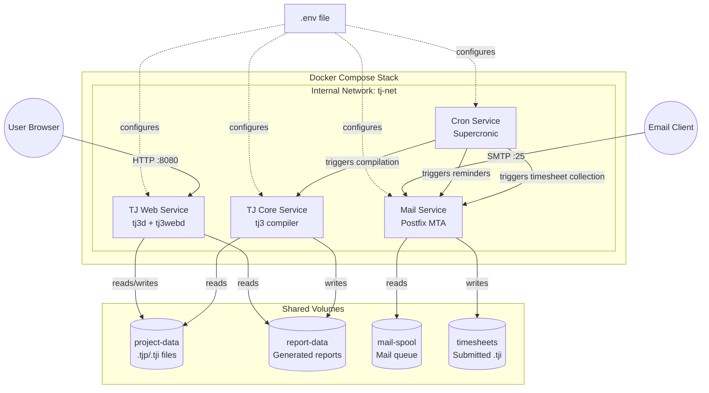
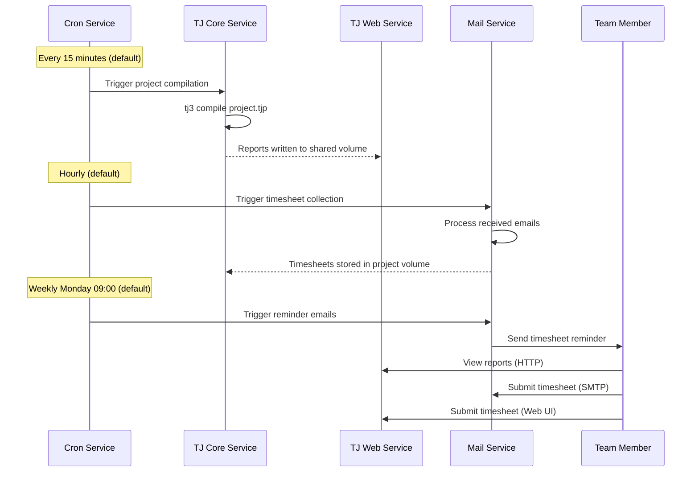
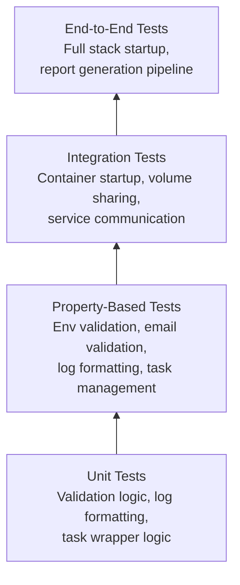

# Design Document

## Overview

This design describes an all-in-one Docker Compose system for TaskJuggler that packages the core scheduling engine, web reporting interface, email-based timesheet exchange, and cron orchestration into a single deployable stack. The system uses a multi-container architecture where each service has a single responsibility, communicates over an internal Docker network, and shares data through named volumes.

The design prioritizes out-of-the-box operation: a user clones the repository, runs `docker compose up`, and gets a fully functional TaskJuggler environment with sample project reports visible in the browser within two minutes.

### Key Design Decisions

1. **Custom Dockerfiles over pre-built images**: TaskJuggler is a Ruby gem with specific version requirements. Building custom images ensures consistent, reproducible environments with all TJ3 tools (`tj3`, `tj3d`, `tj3webd`, `tj3ts_sender`, `tj3ts_receiver`) pre-installed.

2. **Postfix as MTA**: Postfix is chosen for the mail service due to its lightweight footprint, extensive Docker community support, and ability to function as both a local delivery agent and SMTP relay.

3. **Supercronic over system cron**: Supercronic is a cron replacement designed for containers — it logs to stdout, doesn't require a syslog daemon, and handles signals properly for graceful shutdown.

4. **Entrypoint scripts for validation**: Each service uses an entrypoint script that validates required environment variables before starting the main process, providing clear error messages on misconfiguration.

5. **Health-check-gated startup order**: Services use `depends_on` with `condition: service_healthy` to ensure proper startup sequencing rather than simple container-started checks.

## Architecture



### Service Interaction Flow



## Components and Interfaces

### 1. TJ Core Service (`tj-core`)

**Base Image**: `ruby:3.2-slim`  
**Installed Tools**: `tj3` (TaskJuggler gem)  
**Role**: Compiles TaskJuggler project files and generates reports on demand.

| Interface | Type | Description |
|-----------|------|-------------|
| Project Volume | Volume mount (RW) | `/app/project` — reads `.tjp`/`.tji` files |
| Report Volume | Volume mount (RW) | `/app/reports` — writes generated HTML/CSV reports |
| Timesheet Volume | Volume mount (RO) | `/app/timesheets` — reads submitted timesheets |
| Compilation trigger | Exec via `docker exec` | Cron service executes `tj3` inside this container |

**Entrypoint behavior**:
1. Validate `TJ_PROJECT_FILE` environment variable is set
2. Verify the project file exists in the project volume
3. Keep container alive (tail -f /dev/null or sleep loop) awaiting exec triggers

**Compilation script** (`/app/scripts/compile.sh`):
- Runs `tj3 /app/project/${TJ_PROJECT_FILE}`
- On success: logs timestamp + report count, exits 0
- On failure: logs full tj3 error output to stderr, exits non-zero

### 2. TJ Web Service (`tj-web`)

**Base Image**: `ruby:3.2-slim`  
**Installed Tools**: `tj3d`, `tj3webd` (TaskJuggler gem)  
**Role**: Serves project reports via HTTP and accepts timesheet submissions through the web UI.

| Interface | Type | Description |
|-----------|------|-------------|
| HTTP port | TCP (configurable, default 8080) | Exposed to host for browser access |
| Daemon port | TCP 8474 (internal) | `tj3d` listens for `tj3webd` connections |
| Report Volume | Volume mount (RO) | `/app/reports` — serves generated reports |
| Project Volume | Volume mount (RW) | `/app/project` — stores web-submitted timesheets |

**Process supervision**: An entrypoint script starts `tj3d` and `tj3webd` under a lightweight process manager (e.g., `supervisord` or a bash trap-based wrapper) that restarts either process if it exits.

**Health check**: `curl -f http://localhost:${TJ_WEB_PORT:-8080}/ || exit 1`

**Fallback page**: When no reports exist in the report volume, the web service serves a static HTML page indicating reports have not yet been generated.

### 3. Mail Service (`tj-mail`)

**Base Image**: `alpine:3.19`  
**Installed Software**: Postfix, procmail/maildrop for local delivery  
**Role**: Receives timesheet emails, validates attachments, stores valid timesheets, and sends outbound notifications.

| Interface | Type | Description |
|-----------|------|-------------|
| SMTP port 25 | TCP (internal) | Receives email from external sources |
| Timesheet Volume | Volume mount (RW) | `/app/timesheets` — stores valid `.tji` attachments |
| Mail Spool | Volume mount (RW) | `/var/spool/postfix` — persistent mail queue |

**Inbound email processing pipeline**:
1. Postfix receives email addressed to configured mail domain
2. A local delivery script (procmail recipe or Postfix pipe transport) extracts attachments
3. Validation checks:
   - Attachment has `.tji` extension
   - Attachment size ≤ 1 MB
   - Total message size ≤ 5 MB
4. Valid attachments are copied to the timesheet volume
5. Invalid emails are rejected with logged reason (sender, subject, rejection cause)

**Outbound email**: Postfix configured as relay client using SMTP credentials from the environment file for sending reminders and notifications.

**Health check**: `postfix status && echo "healthy" || exit 1`

### 4. Cron Service (`tj-cron`)

**Base Image**: `alpine:3.19`  
**Installed Software**: Supercronic, Docker CLI (for `docker exec`)  
**Role**: Orchestrates scheduled tasks across all services.

| Interface | Type | Description |
|-----------|------|-------------|
| Docker socket | Volume mount (RO) | `/var/run/docker.sock` — executes commands in other containers |
| Crontab file | Generated from env | `/app/crontab` — schedule definitions |

**Scheduled tasks**:

| Task | Default Schedule | Action |
|------|-----------------|--------|
| Project compilation | `*/15 * * * *` | `docker exec tj-core /app/scripts/compile.sh` |
| Timesheet collection | `0 * * * *` | `docker exec tj-mail /app/scripts/collect-timesheets.sh` |
| Timesheet reminders | `0 9 * * 1` | `docker exec tj-mail /app/scripts/send-reminders.sh` |

**Task execution wrapper** (`/app/scripts/run-task.sh`):
- Checks for lock file (prevents overlapping executions)
- Creates lock file with PID and start timestamp
- Executes the task with configurable timeout (default: 300s)
- On success: logs completion with timestamp and task name
- On failure: logs timestamp, task name, exit code, first 1000 chars of stderr
- On timeout: kills process, logs timeout warning
- Removes lock file on exit

**Health check**: Verifies supercronic process is running.

### 5. Environment Configuration

**File**: `.env` (user-created from `.env.example`)

```ini
# === Project Configuration ===
TJ_PROJECT_PATH=./project          # Host path to project files (bind mount)
TJ_PROJECT_FILE=project.tjp        # Main project file name

# === Web Service ===
TJ_WEB_PORT=8080                   # Host port for web interface (1-65535)

# === Mail Configuration ===
TJ_MAIL_DOMAIN=taskjuggler.local   # Mail domain for receiving timesheets
TJ_SMTP_HOST=smtp.example.com     # Outbound SMTP relay host (REQUIRED)
TJ_SMTP_PORT=587                   # Outbound SMTP relay port (REQUIRED)
TJ_SMTP_USER=                      # SMTP authentication username
TJ_SMTP_PASSWORD=                  # SMTP authentication password
TJ_MAIL_SENDER=taskjuggler@example.com  # Sender address for notifications

# === Cron Schedules ===
TJ_CRON_COMPILE=*/15 * * * *      # Project compilation schedule
TJ_CRON_TIMESHEETS=0 * * * *      # Timesheet collection schedule
TJ_CRON_REMINDERS=0 9 * * 1       # Reminder email schedule

# === System ===
TJ_TIMEZONE=UTC                    # IANA timezone (e.g., Europe/Stockholm)
TJ_LOG_LEVEL=INFO                  # Log level: DEBUG, INFO, WARNING, ERROR
TJ_TASK_TIMEOUT=300                # Cron task timeout in seconds
```

### 6. Startup Validation

An init container or entrypoint validation script checks:
1. Required variables (`TJ_SMTP_HOST`, `TJ_SMTP_PORT`, `TJ_MAIL_DOMAIN`) are defined and non-empty
2. `TJ_WEB_PORT` is a valid port number (1–65535)
3. `TJ_LOG_LEVEL` is one of the accepted values (falls back to INFO with warning if invalid)
4. `TJ_TIMEZONE` is a valid IANA timezone identifier

If validation fails, the service refuses to start and outputs a clear error message identifying the missing or invalid variable.

## Data Models

### Volume Layout

```
project-data/                    # Named volume or bind mount
├── project.tjp                  # Main project file
├── includes/                    # Included .tji files
│   ├── resources.tji            # Resource definitions (people, rates, hours, vacations)
│   ├── tasks.tji                # Task hierarchy (phases, milestones, dependencies)
│   ├── reports.tji              # Report definitions (Gantt, resource, task list, cost)
│   └── accounts.tji            # Cost accounts and rate definitions
├── timesheets/                  # Submitted timesheet files
│   ├── 2024-W03-alice.tji
│   ├── 2024-W03-bob.tji
│   ├── 2024-W04-alice.tji
│   └── 2024-W04-bob.tji
└── README.md                    # Sample project documentation

report-data/                     # Named volume
├── Overview.html
├── ResourceGraph.html
├── TaskList.csv
└── ...

mail-spool/                      # Named volume
└── postfix/                     # Postfix queue directories
    ├── active/
    ├── deferred/
    ├── incoming/
    └── maildrop/
```

### Docker Compose Service Definitions

```yaml
# docker-compose.yml structure (simplified)
services:
  tj-core:
    build: ./services/tj-core
    volumes:
      - project-data:/app/project
      - report-data:/app/reports
      - timesheet-data:/app/timesheets:ro
    env_file: .env
    restart: unless-stopped
    healthcheck:
      test: ["CMD", "tj3", "--version"]
      interval: 30s
      timeout: 10s
      retries: 3

  tj-web:
    build: ./services/tj-web
    ports:
      - "${TJ_WEB_PORT:-8080}:8080"
    volumes:
      - report-data:/app/reports:ro
      - project-data:/app/project
    env_file: .env
    depends_on:
      tj-core:
        condition: service_healthy
    restart: unless-stopped
    healthcheck:
      test: ["CMD", "curl", "-f", "http://localhost:8080/"]
      interval: 30s
      timeout: 10s
      retries: 3

  tj-mail:
    build: ./services/tj-mail
    volumes:
      - timesheet-data:/app/timesheets
      - mail-spool:/var/spool/postfix
    env_file: .env
    restart: unless-stopped
    healthcheck:
      test: ["CMD", "postfix", "status"]
      interval: 30s
      timeout: 10s
      retries: 3
    networks:
      - tj-net

  tj-cron:
    build: ./services/tj-cron
    volumes:
      - /var/run/docker.sock:/var/run/docker.sock:ro
    env_file: .env
    depends_on:
      tj-mail:
        condition: service_healthy
    restart: unless-stopped
    healthcheck:
      test: ["CMD", "pgrep", "supercronic"]
      interval: 30s
      timeout: 10s
      retries: 3

volumes:
  project-data:
  report-data:
  timesheet-data:
  mail-spool:

networks:
  tj-net:
    driver: bridge
```

### Environment Variable Validation Schema

| Variable | Required | Type | Default | Validation |
|----------|----------|------|---------|------------|
| `TJ_PROJECT_PATH` | No | Path | `./project` | Directory must exist on host |
| `TJ_PROJECT_FILE` | No | String | `project.tjp` | Must end in `.tjp` |
| `TJ_WEB_PORT` | No | Integer | `8080` | 1–65535 |
| `TJ_MAIL_DOMAIN` | Yes | String | — | Non-empty, valid domain format |
| `TJ_SMTP_HOST` | Yes | String | — | Non-empty |
| `TJ_SMTP_PORT` | Yes | Integer | — | 1–65535 |
| `TJ_SMTP_USER` | No | String | — | — |
| `TJ_SMTP_PASSWORD` | No | String | — | — |
| `TJ_MAIL_SENDER` | No | String | `taskjuggler@${TJ_MAIL_DOMAIN}` | Valid email format |
| `TJ_TIMEZONE` | No | String | `UTC` | Valid IANA timezone |
| `TJ_LOG_LEVEL` | No | Enum | `INFO` | DEBUG\|INFO\|WARNING\|ERROR |
| `TJ_CRON_COMPILE` | No | Cron expr | `*/15 * * * *` | Valid 5-field cron |
| `TJ_CRON_TIMESHEETS` | No | Cron expr | `0 * * * *` | Valid 5-field cron |
| `TJ_CRON_REMINDERS` | No | Cron expr | `0 9 * * 1` | Valid 5-field cron |
| `TJ_TASK_TIMEOUT` | No | Integer | `300` | > 0 |

### Log Entry Format

All services produce structured log output to stdout/stderr:

```
[SERVICE_NAME] [ISO8601_TIMESTAMP] [LEVEL] message
```

Example:
```
[tj-core] [2024-01-15T10:30:00Z] [INFO] Project compilation completed: 5 reports generated
[tj-mail] [2024-01-15T10:31:00Z] [WARNING] Rejected email from bob@example.com: attachment exceeds 1MB
[tj-cron] [2024-01-15T10:45:00Z] [ERROR] Task 'compile' failed: exit code 1
```


## Sample Project Design

The sample project serves dual purposes: a functional demo that produces meaningful reports on first `docker compose up`, and an educational reference showing TaskJuggler's advanced features. It models a realistic software development project ("Acme Web Platform") with multiple phases, teams, and cost centers.

### File Structure

```
project/
├── project.tjp                    # Main project file (project header, macros, includes)
├── includes/
│   ├── resources.tji              # Resource definitions (people, rates, working hours, vacations)
│   ├── tasks.tji                  # Task hierarchy (phases, milestones, dependencies)
│   ├── reports.tji                # Report definitions (Gantt, resource usage, task list, cost)
│   └── accounts.tji              # Cost accounts and rate definitions
├── timesheets/
│   ├── 2024-W03-alice.tji        # Alice's timesheet for week 3
│   ├── 2024-W03-bob.tji          # Bob's timesheet for week 3
│   ├── 2024-W04-alice.tji        # Alice's timesheet for week 4
│   └── 2024-W04-bob.tji          # Bob's timesheet for week 4
└── README.md                      # Sample project documentation
```

### Main Project File (`project.tjp`)

The main file defines the project header (name, start/end dates, default working hours, currency) and includes all modular files:

```tjp
project acme_web "Acme Web Platform" 2024-01-15 +16w {
  timezone "Europe/Stockholm"
  timeformat "%Y-%m-%d"
  numberformat "-" "" "," "." 1
  currencyformat "(" ")" "," "." 0
  currency "SEK"
  now 2024-02-05
  trackingscenario plan
}

include "includes/accounts.tji"
include "includes/resources.tji"
include "includes/tasks.tji"
include "includes/reports.tji"
```

### Resource Definitions (`includes/resources.tji`)

Defines team members with varying characteristics:

| Resource | Role | Working Hours | Rate (SEK/h) | Skills | Vacations |
|----------|------|---------------|---------------|--------|-----------|
| Alice | Senior Developer | 8h/day (Mon–Fri) | 950 | backend, architecture | 2024-02-19 – 2024-02-23 (winter break) |
| Bob | Full-Stack Developer | 8h/day (Mon–Fri) | 800 | frontend, backend | 2024-03-25 – 2024-03-29 (Easter) |
| Carol | UX Designer | 6h/day (Mon–Thu) | 750 | design, frontend | None |
| Dave | QA Engineer | 8h/day (Mon–Fri) | 700 | testing, automation | 2024-04-01 – 2024-04-05 |
| Eve | Project Manager | 4h/day (Mon–Fri) | 900 | management | None |

Resources use `limits`, `vacation`, and `workinghours` directives to demonstrate different scheduling constraints. Skill sets are assigned via custom resource attributes for allocation matching.

### Task Hierarchy (`includes/tasks.tji`)

Work is organized into four project phases with hierarchical decomposition:

```
Acme Web Platform
├── Phase 1: Planning (2 weeks)
│   ├── Requirements gathering [Eve, Alice]
│   ├── Architecture design [Alice]
│   ├── UX wireframes [Carol]
│   └── ★ Milestone: Planning Complete
├── Phase 2: Development (6 weeks)
│   ├── Backend API
│   │   ├── Database schema [Alice]
│   │   ├── REST endpoints [Alice, Bob]
│   │   └── Authentication [Alice]
│   ├── Frontend UI
│   │   ├── Component library [Bob, Carol]
│   │   ├── Page layouts [Bob]
│   │   └── API integration [Bob]
│   └── ★ Milestone: Feature Complete
├── Phase 3: Testing (4 weeks)
│   ├── Unit test suite [Dave]
│   ├── Integration testing [Dave, Bob]
│   ├── Performance testing [Dave]
│   ├── UAT [Eve, Carol]
│   └── ★ Milestone: Release Candidate
└── Phase 4: Deployment (2 weeks)
    ├── Infrastructure setup [Alice]
    ├── Staging deployment [Alice, Dave]
    ├── Production deployment [Alice]
    └── ★ Milestone: Go Live
```

**Dependency examples**:
- "Architecture design" `depends` on "Requirements gathering"
- All Phase 2 tasks `depend` on "Planning Complete" milestone
- "API integration" `depends` on "REST endpoints"
- "Integration testing" `depends` on "Feature Complete" milestone
- "Production deployment" `depends` on "Release Candidate" milestone

**Resource leveling demonstration**: Alice is allocated to both "REST endpoints" and "Authentication" during the same period, forcing the scheduler to level and sequence these tasks. Bob is allocated to "Component library" and "Page layouts" concurrently, demonstrating conflict resolution.

### Cost Accounts (`includes/accounts.tji`)

Defines cost tracking structure:

```tjp
account cost "Project Costs" {
  account dev "Development" {
    account backend "Backend Development"
    account frontend "Frontend Development"
  }
  account design "Design"
  account qa "Quality Assurance"
  account mgmt "Project Management"
}

account revenue "Revenue" {
  account contract "Contract Payment"
}
```

Each task is assigned to a cost account, and each resource has an hourly rate. This produces meaningful data in the cost report showing budget consumption per phase and per team.

### Report Definitions (`includes/reports.tji`)

Four distinct report types are generated:

| Report | Type | Description |
|--------|------|-------------|
| `GanttChart` | `taskreport` | Full project Gantt chart with dependencies, milestones, and critical path highlighted |
| `ResourceUsage` | `resourcereport` | Resource allocation over time showing utilization percentages and conflicts |
| `TaskList` | `taskreport` (list format) | Flat task list with start/end dates, effort, cost, and completion status |
| `CostReport` | `accountreport` | Financial breakdown by cost account showing planned vs. actual costs |

Each report is configured with appropriate columns, time scales, and filters to demonstrate TaskJuggler's reporting flexibility.

### Timesheet Integration

The sample timesheets demonstrate the timesheet workflow that integrates with the Mail Service and Cron Service:

**`timesheets/2024-W03-alice.tji`** (example):
```tjp
timesheet alice 2024-01-15 +1w {
  task acme_web.dev.backend.schema {
    work 32h
    status green "Schema design completed" {
      summary "Finalized database schema for all entities"
    }
  }
  task acme_web.dev.backend.endpoints {
    work 8h
    status yellow "Started endpoint scaffolding"
  }
}
```

**Workflow integration**:
1. Team members submit timesheets via email (Mail Service) or web UI (Web Service)
2. Timesheets land in `project/timesheets/` directory
3. Cron Service triggers timesheet collection on schedule
4. Next project compilation incorporates timesheet data
5. Reports reflect actual progress vs. planned schedule

The sample includes timesheets from Alice and Bob for two consecutive weeks (W03 and W04), showing progression of work across backend and frontend tasks. This demonstrates how the `trackingscenario` in the main project file uses timesheet data to compare planned vs. actual.

### Modular Structure Rationale

The include-file approach provides:

1. **Separation of concerns**: Resources, tasks, reports, and accounts are independently editable
2. **Team collaboration**: Different team members can edit their respective files without merge conflicts
3. **Scalability**: New phases or resources are added by extending the relevant include file
4. **Reusability**: Report definitions can be reused across projects by copying `reports.tji`
5. **Clarity**: The main `.tjp` file serves as a table of contents, making project structure immediately visible

### Sample Project Documentation (`project/README.md`)

The included README covers:
- Project overview and what the sample demonstrates
- File-by-file explanation of each include file's purpose
- How to modify the sample (add resources, tasks, change dates)
- How timesheets work and how to submit them
- How to create a new project from scratch using this structure as a template
- Links to TaskJuggler documentation for each feature demonstrated

## Manual Trigger Scripts

### Overview

Three host-executable scripts in the `scripts/` directory at the repository root allow administrators and users to manually trigger the same operations that the Cron Service runs on schedule. These scripts provide an immediate way to kick off a rebuild, collect timesheets, or send reminders without waiting for the next cron cycle.

### Script Inventory

| Script | Operation | Equivalent Cron Task |
|--------|-----------|---------------------|
| `scripts/rebuild.sh` | Project compilation | `docker exec tj-core /app/scripts/compile.sh` |
| `scripts/collect-timesheets.sh` | Timesheet collection | `docker exec tj-mail /app/scripts/collect-timesheets.sh` |
| `scripts/send-reminders.sh` | Reminder emails | `docker exec tj-mail /app/scripts/send-reminders.sh` |

### Execution Mechanism

Each script uses `docker exec` to run the same internal container script that the Cron Service invokes. This ensures identical behavior whether triggered manually or by schedule:

```bash
#!/usr/bin/env bash
# scripts/rebuild.sh (simplified structure)
set -euo pipefail

CONTAINER="tj-core"
LOCK_FILE="/tmp/tj-compile.lock"
SCRIPT="/app/scripts/compile.sh"

# Check container is running
if ! docker inspect --format='{{.State.Running}}' "$CONTAINER" 2>/dev/null | grep -q true; then
    echo -e "\033[31m✗ Container '$CONTAINER' is not running.\033[0m"
    echo "  Start the stack with: docker compose up -d"
    exit 1
fi

# Check lock file (same mechanism as cron task wrapper)
if docker exec "$CONTAINER" test -f "$LOCK_FILE"; then
    echo -e "\033[33m⚠ Operation already in progress (lock file exists).\033[0m"
    STARTED=$(docker exec "$CONTAINER" cat "$LOCK_FILE" 2>/dev/null || echo "unknown")
    echo "  Started: $STARTED"
    echo "  If this is stale, remove it with: docker exec $CONTAINER rm $LOCK_FILE"
    exit 1
fi

# Execute
echo -e "\033[34m→ Triggering project compilation...\033[0m"
docker exec "$CONTAINER" "$SCRIPT"
EXIT_CODE=$?

if [ $EXIT_CODE -eq 0 ]; then
    echo -e "\033[32m✓ Compilation completed successfully.\033[0m"
else
    echo -e "\033[31m✗ Compilation failed (exit code: $EXIT_CODE).\033[0m"
    exit $EXIT_CODE
fi
```

### Lock File Interaction

The manual trigger scripts respect the same lock file mechanism used by the Cron Service's task execution wrapper (`/app/scripts/run-task.sh`):

- **Before execution**: The script checks whether the lock file exists inside the target container. If it does, the operation is already running (either from cron or another manual invocation) and the script refuses to start a duplicate.
- **During execution**: The lock file is created and managed by the internal container script (same as when triggered by cron). The host script does not create or remove lock files directly — it delegates that to the container-side wrapper.
- **After execution**: The container-side wrapper removes the lock file on completion (success or failure).

This design means manual scripts and cron-triggered tasks are mutually exclusive — they cannot overlap regardless of which mechanism initiated the operation.

### User Output Format

All scripts produce colored terminal output with clear status indicators:

| Symbol | Color | Meaning |
|--------|-------|---------|
| `→` | Blue | Operation starting |
| `✓` | Green | Operation completed successfully |
| `✗` | Red | Operation failed or precondition not met |
| `⚠` | Yellow | Warning (e.g., already running) |

Progress output includes:
- The operation being performed
- Success/failure status with exit code on failure
- Elapsed time for long-running operations (compilation)
- Actionable guidance on errors (e.g., "Start the stack with: docker compose up -d")

### Error Handling

| Condition | Script Behavior | Exit Code |
|-----------|----------------|-----------|
| Target container not running | Prints error with start instructions | 1 |
| Lock file exists (operation in progress) | Prints warning with lock timestamp and stale-lock removal hint | 1 |
| Docker not available / socket inaccessible | Prints error indicating Docker is required | 1 |
| Operation fails inside container | Prints failure with exit code from container | Pass-through |
| Operation succeeds | Prints success confirmation | 0 |

### Independence from Cron Service

The scripts use `docker exec` directly from the host, so they work regardless of whether the Cron Service container (`tj-cron`) is running. They only require:
1. Docker CLI available on the host
2. The target service container running (tj-core or tj-mail)
3. The Docker socket accessible

This means users can stop the Cron Service entirely and rely solely on manual triggers if preferred.

## Documentation Structure

### User Guide (`docs/user-guide.md`)

A comprehensive user guide covering day-to-day operations, organized into the following sections:

#### Content Outline

```
docs/user-guide.md
├── 1. Introduction
│   ├── What this system provides
│   └── Prerequisites (Docker, Docker Compose)
├── 2. Day-to-Day Usage
│   ├── Viewing reports in the browser
│   ├── Understanding report types (Gantt, resource, task list, cost)
│   └── Checking system status (docker compose ps, logs)
├── 3. Timesheet Submission
│   ├── Email-based submission
│   │   ├── Email format and addressing
│   │   ├── Attachment requirements (.tji, ≤1 MB)
│   │   └── Confirmation and error handling
│   ├── Web-based submission
│   │   ├── Accessing the web UI
│   │   └── Upload workflow
│   └── Timesheet file format reference
├── 4. Manual Operations
│   ├── Triggering a project rebuild (scripts/rebuild.sh)
│   ├── Collecting timesheets on demand (scripts/collect-timesheets.sh)
│   ├── Sending reminders manually (scripts/send-reminders.sh)
│   ├── Usage examples and expected output
│   └── Handling "already running" scenarios
├── 5. Customizing Your Project
│   ├── Replacing the sample project with your own
│   ├── Modifying resources, tasks, and reports
│   ├── Adding new report types
│   ├── Changing schedules and timezone
│   └── Configuring email settings
├── 6. Configuration Reference
│   ├── Complete .env variable reference
│   ├── Cron schedule syntax
│   └── Volume mount options
├── 7. Troubleshooting
│   ├── Service won't start (missing env vars, port conflicts)
│   ├── Compilation errors (invalid .tjp syntax)
│   ├── Email delivery problems (SMTP relay, rejected attachments)
│   ├── Permission issues (Docker socket, volume mounts)
│   ├── Reports not updating (cron not running, lock file stale)
│   └── Checking logs (docker compose logs)
└── 8. Architecture Overview
    ├── Service diagram (simplified)
    ├── How services communicate
    └── Volume and data flow
```

#### Writing Approach

- Written for users who are comfortable with Docker but may be new to TaskJuggler
- Task-oriented structure: "How do I..." rather than reference-style documentation
- Includes copy-pasteable command examples for every operation
- Screenshots or terminal output examples for key workflows
- Cross-references to TaskJuggler's own documentation for TJP syntax details

### README Rewrite

The repository root `README.md` is rewritten as a concise getting-started document:

#### README Structure

```markdown
# TaskJuggler Docker Compose

One-paragraph description of what this system provides.

## Quick Start

    git clone <repo>
    cd <repo>
    cp .env.example .env
    docker compose up

→ Open http://localhost:8080 to view reports.

## What's Included

Brief bullet list of services and capabilities (4-5 items).

## Documentation

- [User Guide](docs/user-guide.md) — Day-to-day usage, timesheets, manual operations, troubleshooting
- [Configuration Reference](docs/user-guide.md#6-configuration-reference) — All environment variables and options
- [Sample Project](project/README.md) — How the included demo project works

## Project Structure

Brief tree showing key directories (services/, scripts/, docs/, project/).

## License

One line.
```

#### Design Principles

- **Concise**: The README fits on one screen without scrolling for the common case
- **Action-oriented**: The first thing a user sees is how to get running
- **No duplication**: Detailed information lives in the user guide; the README links to it
- **Discoverable**: Clear signposts to deeper documentation for each topic

### Relationship to Sample Project README

The documentation has three layers:

| Document | Audience | Purpose |
|----------|----------|---------|
| `README.md` (repo root) | New users | Get running in 30 seconds, find deeper docs |
| `docs/user-guide.md` | Active users | Day-to-day operations, customization, troubleshooting |
| `project/README.md` | Users modifying the sample | TaskJuggler project structure, TJP syntax guidance |

The repo README links to both the user guide and the sample project README. The user guide's "Customizing Your Project" section links to the sample project README for TJP-specific details. This avoids circular references while ensuring each document serves a distinct purpose.

## Correctness Properties

*A property is a characteristic or behavior that should hold true across all valid executions of a system — essentially, a formal statement about what the system should do. Properties serve as the bridge between human-readable specifications and machine-verifiable correctness guarantees.*

### Property 1: Environment validation rejects missing required variables with descriptive error

*For any* set of environment variables where one or more required variables (`TJ_SMTP_HOST`, `TJ_SMTP_PORT`, `TJ_MAIL_DOMAIN`) are missing or empty, the validation function SHALL return a failure result AND the error message SHALL contain the name of every missing/empty required variable.

**Validates: Requirements 2.5, 2.6**

### Property 2: Email attachment validation accepts only .tji files within size limit

*For any* email attachment, the validation function SHALL accept it if and only if the filename ends with `.tji` AND the attachment size is ≤ 1 MB. For rejected attachments, the rejection log SHALL contain the sender address, subject line, and reason for rejection.

**Validates: Requirements 5.7, 5.8**

### Property 3: Oversized email rejection

*For any* incoming email with total size exceeding 5 MB, the mail processing function SHALL reject the email AND the rejection log SHALL contain the sender address and the message size.

**Validates: Requirements 5.9**

### Property 4: Log entry format includes service name and ISO 8601 timestamp

*For any* service name and log message, the log formatting function SHALL produce output containing the service name and a valid ISO 8601 timestamp, regardless of message content or length.

**Validates: Requirements 8.2**

### Property 5: Task failure logging includes all required fields with stderr truncation

*For any* failed task execution with arbitrary task name, exit code, and stderr output, the failure log SHALL contain a valid ISO 8601 timestamp, the task name, the exit code, and at most the first 1000 characters of stderr output.

**Validates: Requirements 6.5**

### Property 6: Overlapping task execution is prevented

*For any* scheduled task that is still running when its next execution is due, the cron service SHALL skip the new execution AND log a warning containing the task name and elapsed time since the running instance started.

**Validates: Requirements 6.7**

### Property 7: Invalid log level falls back to INFO with warning

*For any* string value for `TJ_LOG_LEVEL` that is not in the set {DEBUG, INFO, WARNING, ERROR}, the system SHALL use INFO as the effective log level AND produce a warning log indicating the invalid configuration value.

**Validates: Requirements 8.4**

## Error Handling

### Service Startup Failures

| Scenario | Behavior |
|----------|----------|
| Missing required env var | Entrypoint script exits with code 1, prints `[ERROR] Required variable X is not set` |
| Invalid port number | Entrypoint exits with code 1, prints `[ERROR] TJ_WEB_PORT must be between 1 and 65535` |
| Project file not found | TJ Core logs warning but stays alive for future compilation triggers |
| Docker socket not accessible | Cron service exits with code 1, prints `[ERROR] Cannot access Docker socket` |

### Runtime Failures

| Scenario | Behavior |
|----------|----------|
| `tj3` compilation error | Compile script logs full error to stderr, exits non-zero; cron logs failure |
| `tj3d` daemon crash | Supervisor restarts within 30s; health check fails after 3 retries if unrecoverable |
| Postfix crash | Container restart policy triggers restart; health check detects failure |
| Cron task timeout | Task killed after configurable timeout; failure logged with "TIMEOUT" reason |
| Overlapping cron task | New execution skipped; warning logged with elapsed time |
| Invalid email received | Email rejected at SMTP level or during processing; sender/subject/reason logged |
| Disk full (volumes) | Services log write errors; health checks may fail triggering alerts |

### Graceful Degradation

- **No reports available**: Web service serves a "no reports yet" status page instead of erroring
- **Mail relay unreachable**: Outbound emails queued in Postfix deferred queue; retried automatically
- **Project file missing on first start**: Core service stays alive; compilation fails gracefully until file is provided

## Testing Strategy

### Test Layers



### Unit Tests (pytest)

Test the pure logic extracted into Python utility modules:

- **`validate_env.py`**: Environment variable validation logic
- **`validate_attachment.py`**: Email attachment validation (extension, size)
- **`format_log.py`**: Log line formatting
- **`task_runner.py`**: Task execution wrapper (timeout, overlap detection, stderr truncation)

These modules are tested independently of Docker using pytest with fixtures for various input combinations.

### Property-Based Tests (Hypothesis)

Property-based testing library: **Hypothesis** (Python)

Each property test runs a minimum of 100 iterations and is tagged with its design property reference.

| Property | Module Under Test | Generator Strategy |
|----------|-------------------|-------------------|
| Property 1 | `validate_env` | Random dicts with subset of required keys present/absent/empty |
| Property 2 | `validate_attachment` | Random filenames (with/without .tji) × random sizes (0–2MB) |
| Property 3 | `validate_attachment` | Random email sizes (1MB–10MB) |
| Property 4 | `format_log` | Random service names × random message strings (including special chars, unicode) |
| Property 5 | `task_runner` | Random task names × exit codes (1–255) × random stderr strings (0–5000 chars) |
| Property 6 | `task_runner` | Random task names × random elapsed times |
| Property 7 | `validate_env` | Random strings not in valid log level set |

**Configuration**: Each test uses `@settings(max_examples=100)` minimum.

**Tag format**: `# Feature: taskjuggler-docker-compose, Property N: <property text>`

### Integration Tests

Run with Docker Compose in a CI environment:

1. **Stack startup**: Verify all services reach healthy state within 60s
2. **Volume sharing**: Write file in one container, read from another
3. **Compilation pipeline**: Place .tjp file → trigger compile → verify reports appear
4. **Web serving**: Compile reports → HTTP GET → verify 200 response with report content
5. **Email reception**: Send SMTP email with .tji attachment → verify file in timesheets volume
6. **Cron execution**: Wait for scheduled task → verify execution log

### End-to-End Tests

Full workflow validation:

1. `docker compose up` with default config → all health checks pass within 120s
2. Sample project compiles → reports visible in browser
3. Timesheet email → processed → included in next compilation
4. Service crash → automatic restart → health restored

### Test Execution

```bash
# Unit + Property tests (fast, no Docker required)
uv run pytest tests/unit/ tests/property/ --tb=short -q

# Integration tests (requires Docker)
uv run pytest tests/integration/ --tb=short -q

# Full E2E (requires Docker, slower)
uv run pytest tests/e2e/ --tb=short -q
```
